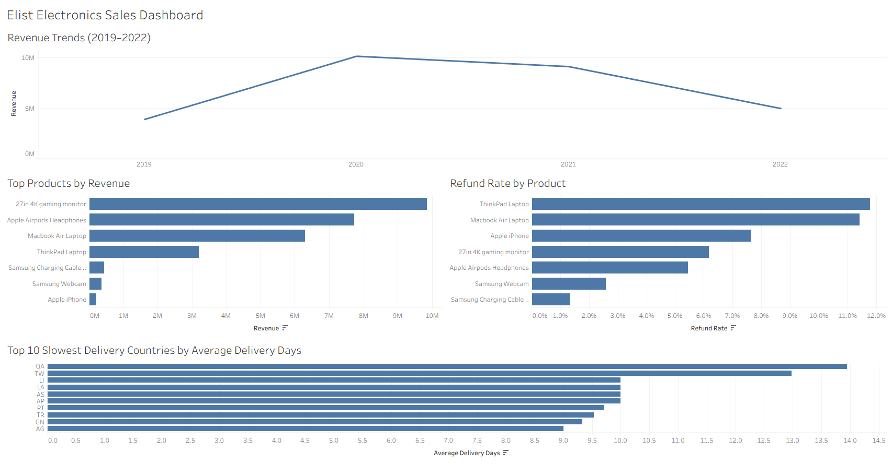

# Elist Electronics Sales Analysis
Owen Campbell

## Overview

This project analyzes transactional, customer, and operational data for Elist, a global e-commerce electronics retailer, to better understand sales trends, customer behavior, product performance, refunds, and delivery efficiency. The analysis was completed using Excel, SQL in Google BigQuery, and Tableau.

## Dashboard Preview

The dashboard highlights the main findings from the analysis, including revenue trends, top revenue generating products, refund rates by product, and countries with the longest average delivery times.

## Business Problem

Elist collects transactional and customer data through its e-commerce platform, but the raw data needs to be organized and analyzed before it can support business decisions.

## Objectives

- Analyze overall sales and order trends over time
- Evaluate customer purchasing behavior
- Identify products with high refund rates
- Compare delivery performance across regions
- Compare loyalty and non-loyalty customer purchasing behavior
- Identify top performing products by revenue

## Dataset

The dataset contains transactional and customer level e-commerce data for Elist, including:
- orders and revenue
- products and refunds
- delivery performance
- customer regions
- purchase platform data
- loyalty program participation

## Tools Used

- Excel
- Google BigQuery
- SQL
- Tableau
- VS Code
- GitHub

## Data Cleaning & Preparation

- Used the `orders_data_clean` worksheet from the Excel workbook
- Cleaned and structured the dataset for analysis
- Loaded the dataset into Google BigQuery as the `orders` table
- Validated date fields and transactional records before analysis

## Exploratory Analysis

The exploratory analysis focused on identifying trends in:
- revenue and order growth
- average order value
- regional delivery performance
- refund behavior by product
- customer purchasing activity
- loyalty program participation

## Key Business Questions

- How did revenue trend from 2019 through 2022?
- Which products generated the highest total revenue?
- Which products had the highest refund rates?
- Which countries experienced the longest average delivery times?
- Did loyalty program members purchase more quickly than non-loyalty customers?

## Key Insights

### Sales Trends
- Sales peaked in 2020 due to strong order growth
- Revenue declined in 2021 and 2022 as order volume decreased
- Average order value remained relatively stable compared to changes in total sales volume

### Delivery Performance
- Most regions averaged delivery times between 7 to 10 days
- A small number of regions experienced noticeably longer delivery times than the overall average

### Refund Behavior
- Refund rates were relatively low across most products
- ThinkPad Laptop had the highest refund rate among analyzed products

### Product Performance
- The 27in 4K gaming monitor generated the highest total revenue, followed by Apple AirPods Headphones and MacBook Air Laptop

### Loyalty Program Impact
- Loyalty program members purchased slightly sooner after account creation compared to non-members
- The difference between groups was relatively small overall

## Recommendations

- Investigate products with elevated refund rates to identify possible quality or customer expectation issues
- Review delivery performance in slower regions to improve customer experience
- Continue monitoring top performing products to support inventory and marketing decisions
- Explore ways to increase the effectiveness of the loyalty program through stronger customer incentives

## Project Files

- `business_analysis.sql` → SQL queries used throughout the analysis
- `elist_transactions_data_pipeline.xlsx` → cleaned dataset and Excel analysis
- `images/` → dashboard screenshot used in the README
- `README.md` → project documentation and summary