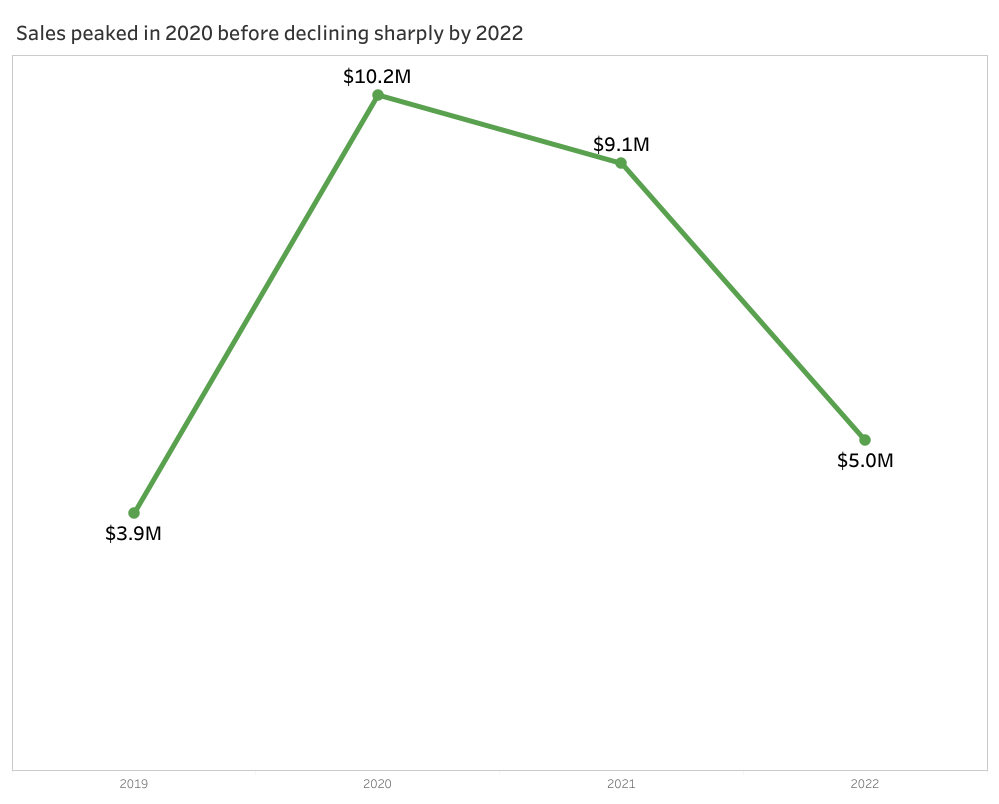
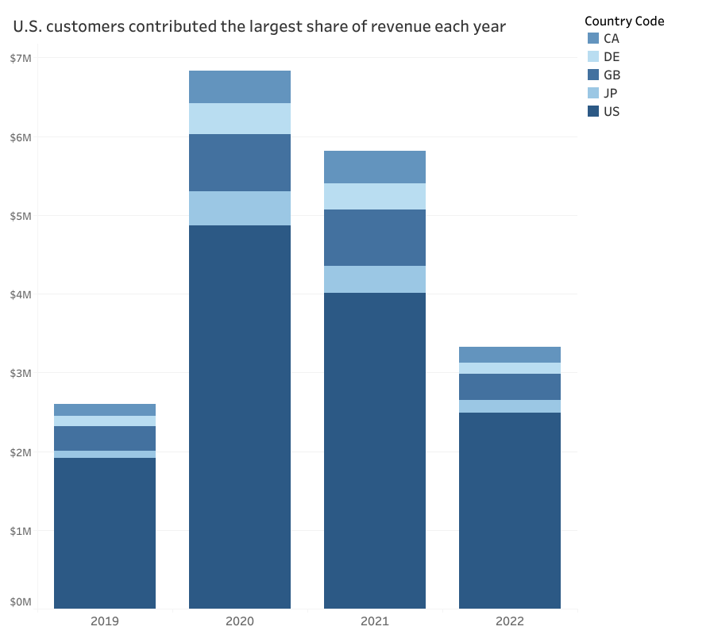
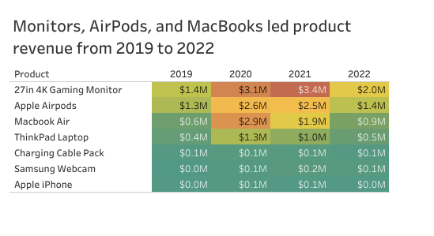
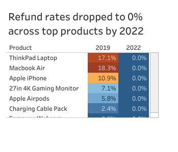

# Elist Electronics Sales Analysis

Owen Campbell

## Overview

This project analyzes sales, product, country, and refund data for Elist, a global electronics retailer. The goal was to understand how revenue changed from 2019 to 2022, which countries and products drove the most sales, and how refund rates changed across top products.

The main story is that Elist reached its strongest revenue year in 2020, stayed strong in 2021, then declined sharply in 2022. Revenue was heavily supported by U.S. customers and a small group of top products, while refund rates improved across the products analyzed.

## Key Findings

* Sales peaked in 2020 at $10.2M before dropping to $5.0M in 2022.
* U.S. customers contributed the largest share of revenue every year.
* Monitors, AirPods, and MacBooks were the strongest product revenue drivers.
* Refund rates dropped to 0% across the top products shown by 2022.

## Sales Trend

Sales increased from $3.9M in 2019 to $10.2M in 2020. Revenue remained strong in 2021 at $9.1M, but dropped to $5.0M in 2022. The 2020 spike may have been influenced by pandemic driven demand for electronics, as customers spent more time working, learning, and shopping from home. By 2022, the decline suggests that Elist may have lost some of that temporary momentum as customer behavior normalized.

## Revenue by Country

U.S. customers contributed the largest share of revenue each year. Other countries added revenue, but the business was clearly most dependent on the U.S. market. Because of this, changes in U.S. customer demand likely had the biggest impact on overall sales performance.

## Product Revenue

Revenue was concentrated in a small group of products. The 27 inch 4K Gaming Monitor, Apple AirPods, and MacBook Air were the strongest revenue drivers from 2019 to 2022. These products should be prioritized when reviewing sales performance, inventory planning, and marketing strategy.

## Refund Rate Analysis

Refund rates were highest in 2019 for products such as the MacBook Air, ThinkPad Laptop, and Apple iPhone. By 2022, refund rates dropped to 0% across the top products shown. This could suggest improvements in product quality, customer expectations, fulfillment, or refund tracking. 

## Business Takeaways

Elist’s strongest revenue period came in 2020, which may have been supported by pandemic driven demand for electronics and online purchasing. However, the sharp decline by 2022 shows that the company may need to rebuild sales momentum as customer behavior normalized. The business should protect its strongest revenue sources, especially U.S. customers and top performing products like monitors, AirPods, and MacBooks.

The drop in refund rates is a positive signal, but it should be reviewed carefully. Elist should confirm whether refunds declined because customer satisfaction improved, because product quality improved, or because refund tracking changed.

## Tools Used

* Excel
* Google BigQuery
* SQL
* Tableau Public
* VS Code
* GitHub

## Project Files

* `business_analysis.sql` contains the SQL queries used for the analysis.
* `elist_transactions_data_pipeline.xlsx` contains the cleaned dataset and Excel work.
* `images/` contains the Tableau visuals used in this README.
* `README.md` contains the project summary and business findings.